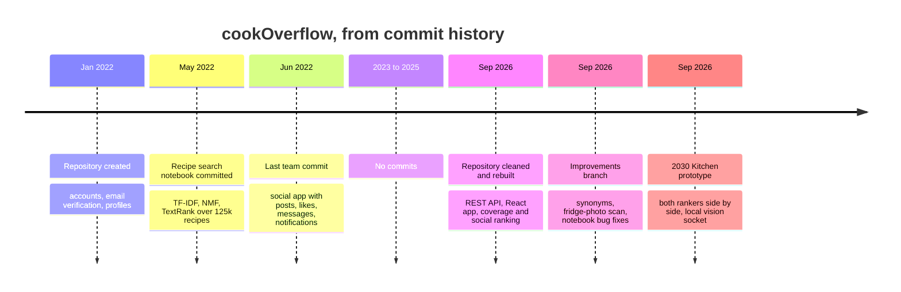
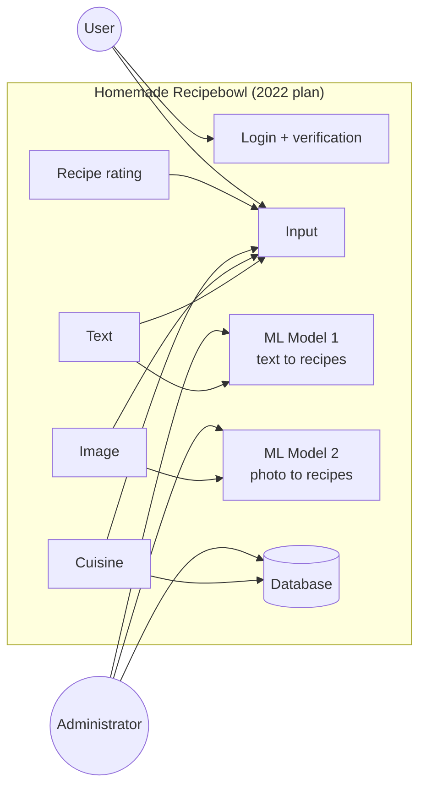
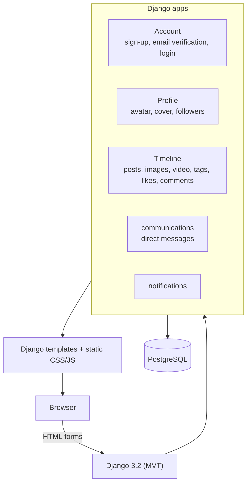

# The cookOverflow story

**From a 2022 search notebook to a kitchen that knows what you can cook, told in system-design diagrams.**

cookOverflow is one question asked three times. In 2022 a graduation project asked it as a text-search
problem: *which recipes are like these words?* In 2026 the app was rebuilt around a different framing:
*what can I actually cook with what I have?* A prototype, the 2030 Kitchen, then put both answers side by
side behind a fridge door. This document tells that story from A to Z, with the diagrams an engineer would
draw at each step, and it is precise about what was built, when, and by whom.

| System | What it is | When | Status |
| --- | --- | --- | --- |
| **R&D notebook** | TF-IDF, NMF topics and TextRank over 125,164 scraped recipes | 2022 | Offline research, never served |
| **cookOverflow Core** | Django + DRF API and React app: social recipes, "What can I cook?", For you, Trending | 2022 app, rebuilt Sep 2026 | This repository, runs locally, not deployed |
| **2030 Kitchen** | FastAPI + Next.js prototype serving coverage and TF-IDF over a 2,000-recipe slice of the 2022 corpus | Sep 2026 | Separate local repository, not deployed |

## Contents

- [A. The question (2022)](#a-the-question-2022)

## The whole story on one line

---

## A. The question (2022)

cookOverflow started as a senior graduation project by Ahmad Droobi and Ataa Shaqour: a food social
network whose own data would answer one question, **"I have these ingredients, what should I cook?"**
The original use-case diagram ([`UMLs/Use_Case_Diagram.jpeg`](UMLs/Use_Case_Diagram.jpeg)) planned two
ways to ask it: typed text feeding "ML Model 1", and a photo feeding "ML Model 2".

The 2022 application itself was a classic server-rendered Django site. It still runs today under
`/legacy/`.

Model 1 was researched in a separate notebook. Model 2 was never built. Neither was wired into the site.
