# The cookOverflow story

**From a 2022 search notebook to a kitchen that knows what you can cook, told in system-design diagrams.**

cookOverflow is one question asked three times. In 2022 a graduation project asked it as a text-search
problem: *which recipes are like these words?* In 2026 the app was rebuilt around a different framing:
*what can I actually cook with what I have?* A prototype, the 2030 Kitchen, then put both answers side by
side behind a fridge door. This document tells that story from A to Z, with the diagrams an engineer would
draw at each step, and it is precise about what was built, when, and by whom.

| System | What it is | When | Status |
| --- | --- | --- | --- |
| **R&D notebook** | TF-IDF, NMF topics and TextRank over 125,164 scraped recipes | 2022 | Offline research, never served |
| **cookOverflow Core** | Django + DRF API and React app: social recipes, "What can I cook?", For you, Trending | 2022 app, rebuilt Sep 2026 | This repository, runs locally, not deployed |
| **2030 Kitchen** | FastAPI + Next.js prototype serving coverage and TF-IDF over a 2,000-recipe slice of the 2022 corpus | Sep 2026 | Separate local repository, not deployed |

## Contents

- [A. The question (2022)](#a-the-question-2022)
- [B. The research pipeline](#b-the-research-pipeline)
- [C. What the research found](#c-what-the-research-found)
- [D. The quiet years](#d-the-quiet-years)
- [E. The rebuild](#e-the-rebuild)
- [F. The pivot: from similarity to feasibility](#f-the-pivot-from-similarity-to-feasibility)
- [G. Social ranking](#g-social-ranking)
- [H. Blast radius](#h-blast-radius)
- [I. Hardening the matcher, adding a camera](#i-hardening-the-matcher-adding-a-camera)
- [J. The 2030 Kitchen](#j-the-2030-kitchen)
- [K. One engine, many inputs](#k-one-engine-many-inputs)
- [L. How it is verified](#l-how-it-is-verified)
- [M. Known limits and what comes next](#m-known-limits-and-what-comes-next)
- [N. Lessons](#n-lessons)
- [Credits and authorship](#credits-and-authorship)

## The whole story on one line

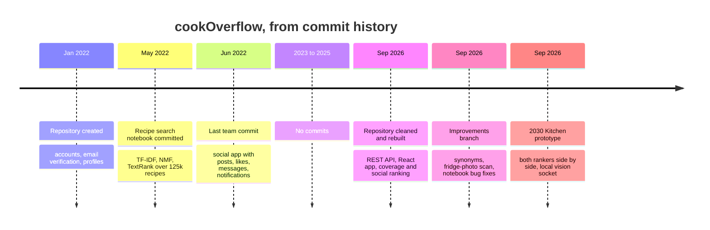

---

## A. The question (2022)

cookOverflow started as a senior graduation project by Ahmad Droobi and Ataa Shaqour: a food social
network whose own data would answer one question, **"I have these ingredients, what should I cook?"**
The original use-case diagram ([`UMLs/Use_Case_Diagram.jpeg`](UMLs/Use_Case_Diagram.jpeg)) planned two
ways to ask it: typed text feeding "ML Model 1", and a photo feeding "ML Model 2".

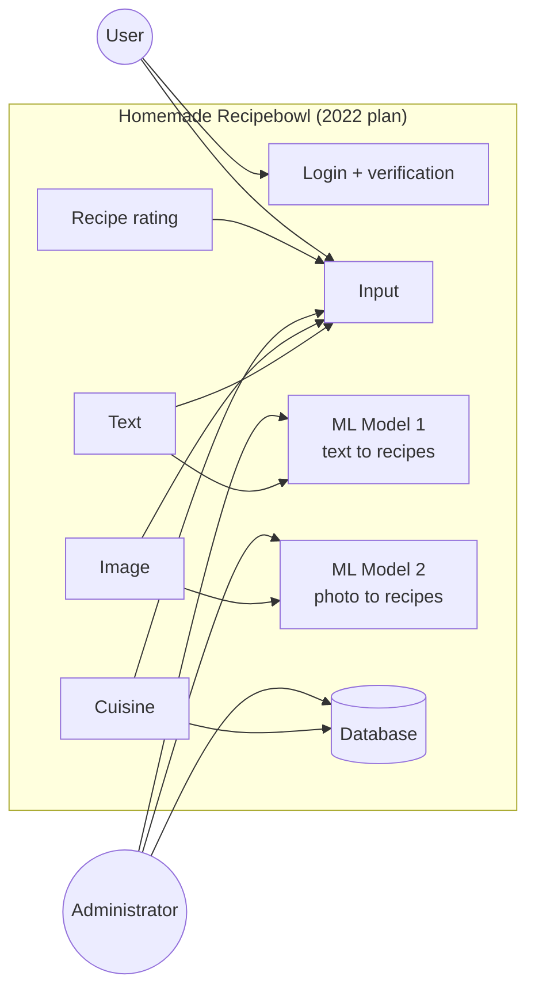

The 2022 application itself was a classic server-rendered Django site. It still runs today under
`/legacy/`.

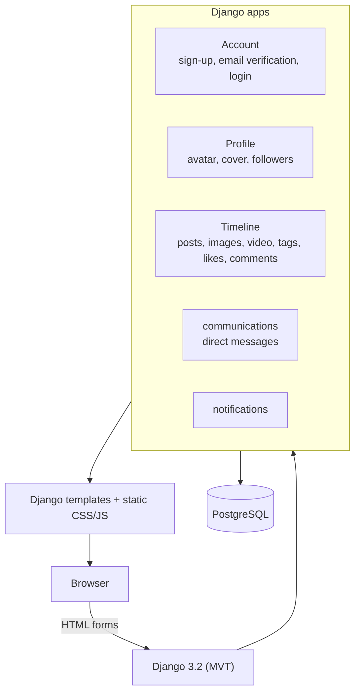

Model 1 was researched in a separate notebook. Model 2 was never built. Neither was wired into the site.

---

## B. The research pipeline

The research lives in [`AI_Search_RecommenderSystem_R&D/`](../AI_Search_RecommenderSystem_R%26D). Its real
control module is the 127-cell notebook `Recipe Recommendation System.ipynb`; `Recommendation_R&D.py` is an
incomplete extract of its cleaning stage. The corpus came from a third-party, MIT-licensed scraper
(`recipe-box-Scraper`, from github.com/rtlee9) run against three recipe sites.

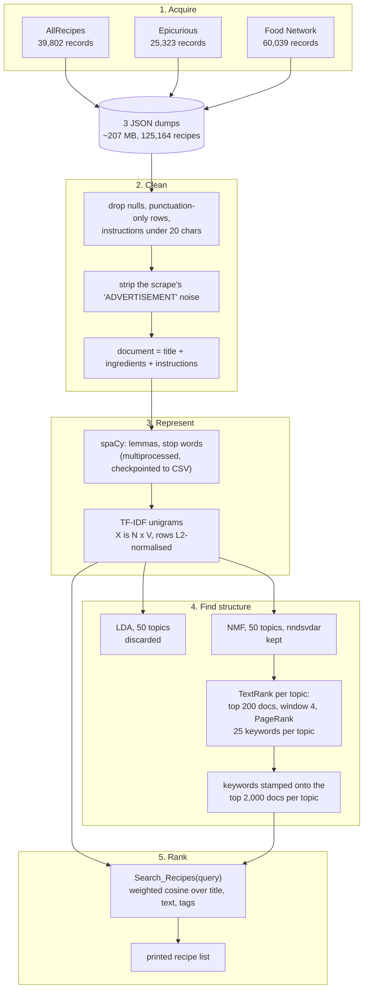

The ranking math, as implemented:

$$
\mathrm{tfidf}(t,d) = \mathrm{tf}(t,d)\cdot\left(\log\frac{1+n}{1+\mathrm{df}(t)}+1\right),
\qquad \lVert d \rVert_2 = 1
$$

$$
s(q,d) = 0.2\,\langle q, d_{\text{title}}\rangle + 0.3\,\langle q, d_{\text{text}}\rangle + 0.5\,\langle q, d_{\text{tags}}\rangle
$$

Because rows are L2-normalised, each inner product is a cosine similarity computed as a sparse dot product.
An optional ranked query (`qweight_array`) splits weight by halves so the first ingredient matters most:
for three ingredients the weights are 0.5, 0.25 and 0.25.

| Parameter | Value in the notebook |
| --- | --- |
| Topics (LDA and NMF) | `N_topics = 50` |
| Documents per topic for keyword extraction | `N_top_docs = 200` |
| Keywords per topic | `N_top_words = 25` |
| Documents tagged per topic | `N_docs_categorized = 2000` |
| TextRank co-occurrence window | `N_neighbor_window = 4` |
| Field weights | `w_title = 0.2`, `w_text = 0.3`, `w_categories = 0.5` |

---

## C. What the research found

The notebook is honest about its own results, and reading it closely surfaces more.

| Finding | Why it matters |
| --- | --- |
| Its conclusion: "the original text of the recipes returns better results than the categories generated with TextRank", yet categories carry 0.5 of the final score | The formula contradicts the experiment |
| Only the top 2,000 documents per topic get tags | Most recipes start with an empty tag field, the field weighted highest |
| NMF was chosen over LDA by reading topics, with no coherence metric, and K = 50 was never validated | A defensible call, but exploratory, not measured |
| LDA was fitted on TF-IDF values | LDA is a model of counts |
| `word.pos_ == ('NOUN' or 'ADJ' or 'VERB')` | The `or` chain evaluates to `'NOUN'`, so adjectives and verbs never reached TextRank |
| TextRank's adjacency is a dense V x V DataFrame filled cell by cell | Quadratic memory; a sparse co-occurrence matrix fits the job |
| `i[0] == np.nan` as the missing-ingredient check | NaN never equals anything, so the check found nothing |
| `nx.from_numpy_matrix` | Removed in NetworkX 3; the notebook no longer runs as written |
| With only the category weight on, `['apple', 'blueberry']` returns three glazed-carrot recipes | Similarity is not intent |
| `['japanese']` returns exactly the list an empty query returns (a crab bisque, a praline torte, artichokes) | A query that matches nothing still gets "results"; there is no no-match path |

The deepest finding is the pattern behind the last two rows. A similarity engine answers **"which
write-ups sound like this?"** That is not the question the project set out to answer.

---

## D. The quiet years

The team's last commit landed on 1 June 2022. Apart from one automated dependency bump in December 2022,
the history is silent until September 2026. The rebuild then moved from the graduation repository to a
new home.

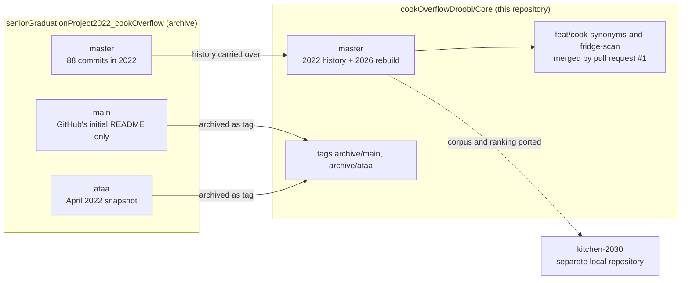

---

## E. The rebuild

The September 2026 rebuild was done with AI assistance: most of its commits carry a Claude co-author
trailer. It began with repository hygiene, then rebuilt the product in layers.

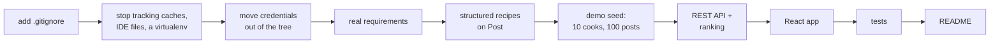

### Containers

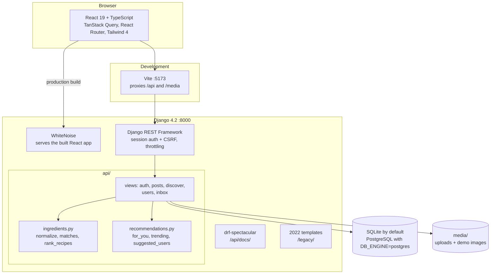

### Data model

A post is both a social post and, when it has ingredients, a structured recipe.

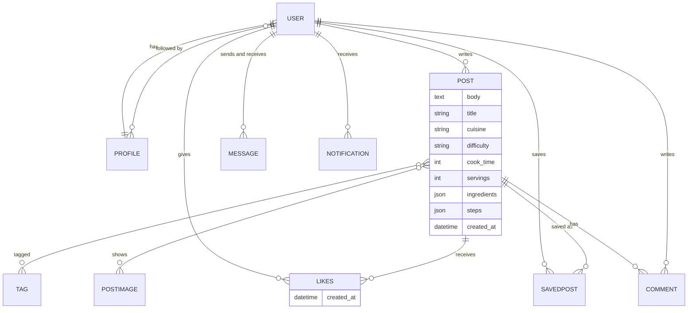

### One request, end to end

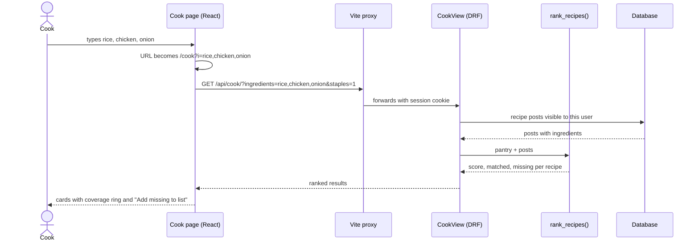

---

## F. The pivot: from similarity to feasibility

This is the most important decision in the project. The rebuilt "What can I cook?" does not use the
notebook at all. It replaces text similarity with pantry coverage, because the two answer different
questions.

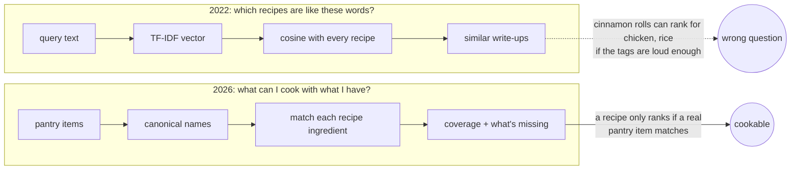

The cook score, as implemented in `api/ingredients.py`:

$$
\mathrm{score}(h,r) = \frac{\lvert \lbrace\, i \in r : \exists\, x \in h,\ \mathrm{matches}(x,i) \ \lor\ i \in \mathrm{staples} \,\rbrace \rvert}{\lvert r \rvert}
$$

Recipes that only staples (salt, water, black pepper, oil, olive oil, sugar) would satisfy are dropped, and
results sort by `(-score, len(missing), -likes)`.

The whole system's correctness rests on two small functions:

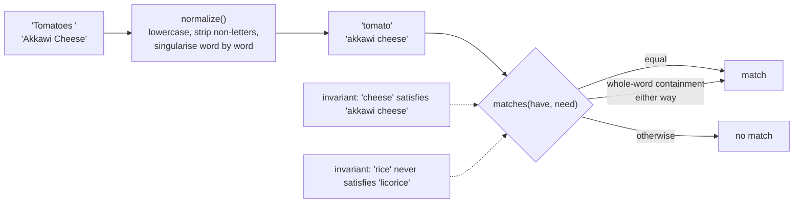

---

## G. Social ranking

The feed has its own rankers. They are hand-designed and explainable: every "For you" post says why it is
there.

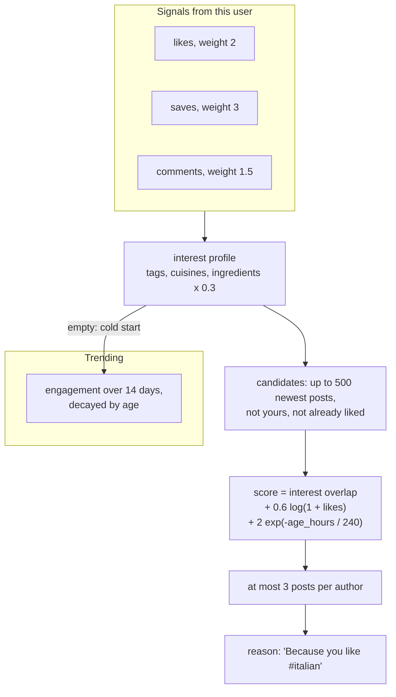

$$
\mathrm{trending}(p) = \frac{1 + \mathrm{likes}_{14\mathrm{d}} + 2\,\mathrm{comments}_{14\mathrm{d}}}{(\mathrm{age}_{\mathrm{days}} + 2)^{1.3}}
$$

So the product runs three rankers with three different jobs:

| Ranker | Question | Signal |
| --- | --- | --- |
| Cook | Can I make this? | ingredient coverage |
| For you | Will this user like it? | their likes, saves, comments |
| Trending | What's active right now? | recent engagement, time decay |

Search (`/api/search/`) is a plain SQL substring match over titles, bodies, cuisines and tags. The weighted
TF-IDF search from 2022 was never ported into Core.

---

## H. Blast radius

Which code, if changed, reaches users? The answer is the opposite of where the mathematical complexity
lives.

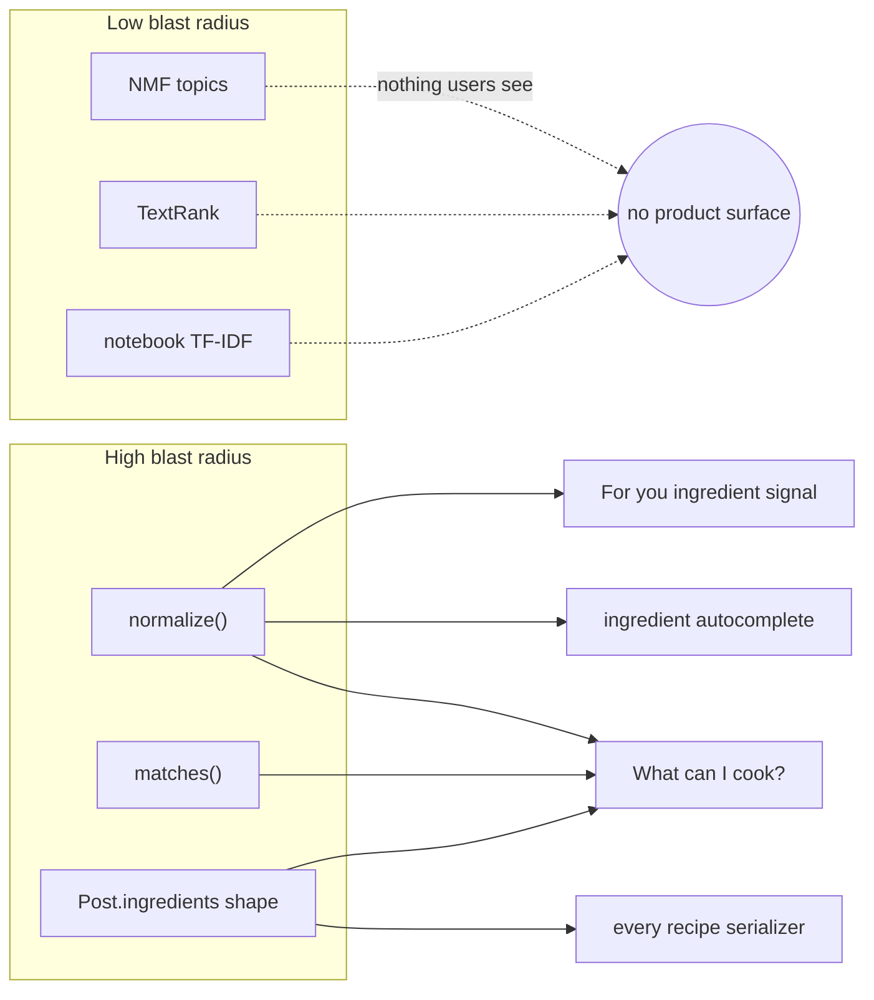

---

## I. Hardening the matcher, adding a camera

A follow-up branch, `feat/cook-synonyms-and-fridge-scan` (11 commits, merged into `master` by pull request #1), applied
the most concrete recommendations from a review of the research.

**Matching.** `normalize()` now maps unambiguous synonyms ("garbanzo beans" to chickpea, "aubergine" to
eggplant, "scallions" to spring onion) and irregular plurals ("bay leaves" to bay leaf, which never matched
before). Bare "coriander" is left alone because it can mean leaves or seeds.

**Notebook.** The part-of-speech bug, the NetworkX 3 incompatibility and the NaN check were fixed in the
source; the saved outputs are still from the original run.

**Fridge photo.** The 2022 "ML Model 2" came back as a vision model in front of the existing ranker, not a
new recommender. It has been tested with the model mocked, never against the live Gemini API.

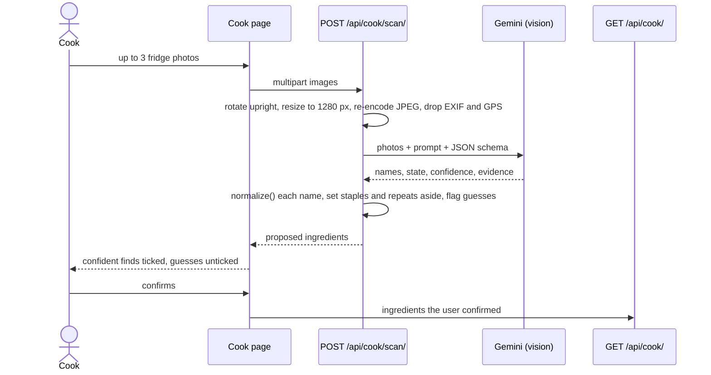

It is off unless `GEMINI_API_KEY` is set, and rate-limited to 30 scans an hour per user.

---

## J. The 2030 Kitchen

The Kitchen is a separate prototype built from a design brief with one rule: **no language model picks
recipes.** It serves both answers from this story, coverage and TF-IDF, from one API, behind a fridge you
open. It lives in its own local repository and is not deployed.

### Containers

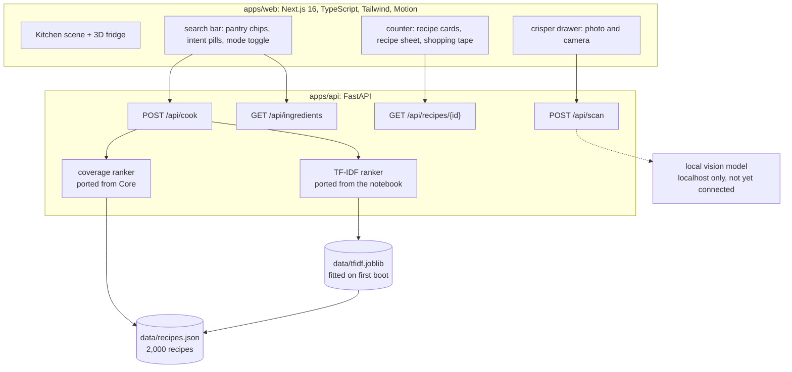

### From the 2022 dumps to a serving corpus

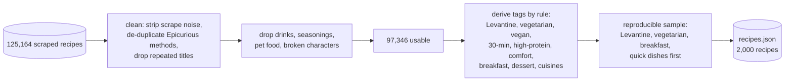

### Two rankers, one request

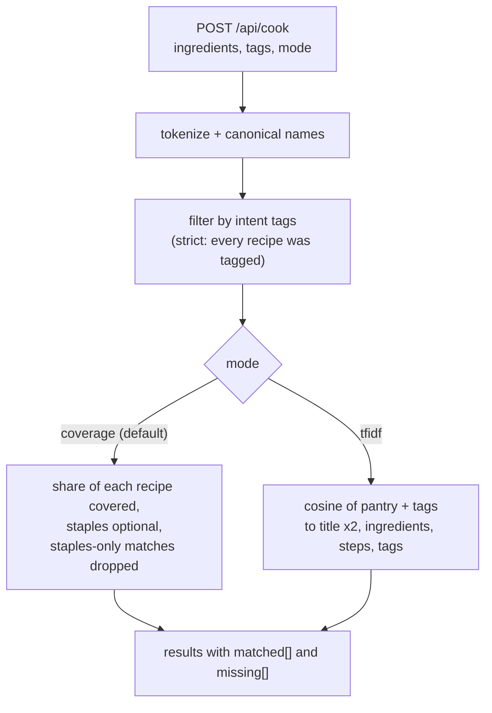

### The page as a state machine

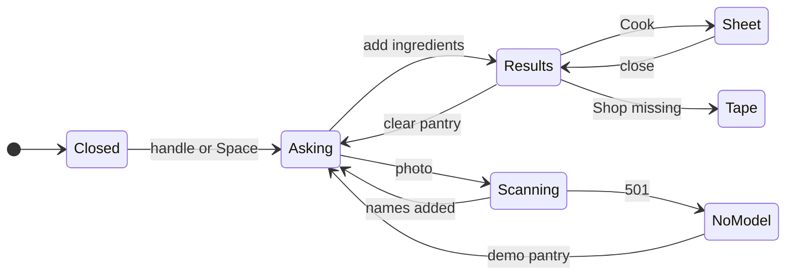

The pantry lives in the URL (`/?have=labneh,tomato&want=Levantine&mode=coverage`), so a kitchen can be
shared. Photos never leave the machine: the scan socket only accepts a localhost model, and in v1 it
answers `501` or a sample pantry.

---

## K. One engine, many inputs

Across both apps the same design principle holds: new ways of asking don't get new intelligence. They
become ingredient names, and the ranker stays the same.

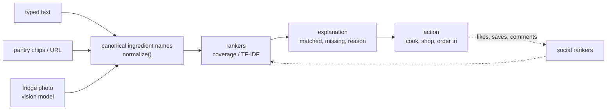

---

## L. How it is verified

| | Core | 2030 Kitchen |
| --- | --- | --- |
| API tests | 42 (Django test runner) | 25 (pytest) |
| Front-end tests | 18 (Vitest + Testing Library), typecheck | typecheck, lint |
| Browser tests | Playwright in Edge: every page, desktop, mobile, dark mode | Playwright smoke in Edge: open the door, type "egg, tomato", see cards |
| Key invariants tested | rice never matches licorice, normalize is idempotent, staples-only recipes dropped | the same, plus shakshuka outranks chocolate cake for egg and tomato |
| Performance | not measured | Enter to rendered cards: median 211 ms over 5 runs, locally, production build |

What is **not** verified anywhere is ranking quality. The tests prove invariants; nothing measures whether
the top five recipes are good. There is already evidence this matters: for "labneh, tomato, pita, egg",
the Kitchen's default coverage sort puts Spaetzle and a royal icing above the shakshukas, because small
recipes are easy to cover. The next piece of engineering is an evaluation harness:

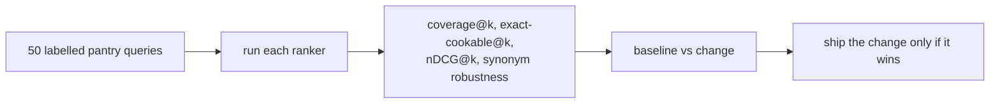

---

## M. Known limits and what comes next

- **Matching is loose in places.** Whole-word containment lets "spring onion" satisfy "onion" and "egg"
  satisfy "egg roll wrapper". It needs a rule about which extra words change the food.
- **The cook ranker scans every recipe.** Fine for hundreds of posts; an ingredient index is the fix at
  scale, once matching semantics allow it.
- **The Kitchen serves scraped recipes.** They were collected for research in 2022 and the dumps carry no
  source links. Clear the rights, serve less (titles and ingredients only), or use recipes you own before
  any public deploy.
- **Vision is untested against real models.** Both designs, cloud (Core) and local (Kitchen), stop at a
  mocked or fixture answer.
- **Nothing is deployed.** Both apps run locally; deploy instructions are in their READMEs.

---

## N. Lessons

```mermaid
flowchart LR
    s1["build a baseline<br/>(TF-IDF search)"] --> s2["read its failures<br/>(similar is not cookable)"]
    s2 --> s3["find the invariants<br/>(rice is not licorice)"]
    s3 --> s4["replace the abstraction<br/>(coverage)"]
    s4 --> s5["test the system,<br/>not the model"]
    s5 --> s6["expose it through a product"]
    s6 --> s7["measure it<br/>(next)"]
```

1. **A model is not a system.** The most sophisticated code in the project (NMF, TextRank) reaches no user.
   Two short functions, `normalize()` and `matches()`, decide what everyone sees.
2. **Name the question before choosing the math.** Similarity and feasibility share a UI and almost no
   math.
3. **Make ranking explain itself.** "You have 5 of 7" and "Because you like #italian" are what make the
   rankings trustworthy.
4. **Add inputs, not intelligence.** A photo is a way of typing ingredients.
5. **Tests prove invariants; only evaluation proves quality.**

---

## Credits and authorship

- **2022:** cookOverflow was built by Ahmad Droobi and Ataa Shaqour as a senior graduation project, with
  a near-even split of commits. The recipe research notebook was committed by Ahmad Droobi in May 2022.
  The scraper is a third-party tool (MIT License, © 2018 rtlee9).
- **2026:** the repository cleanup, the REST API, the React app, the improvements branch and the 2030
  Kitchen were built by Ahmad Droobi with AI assistance (Claude); those commits carry co-author trailers.

Project documents from 2022, including the report, presentation and UML diagrams, are in this folder.
