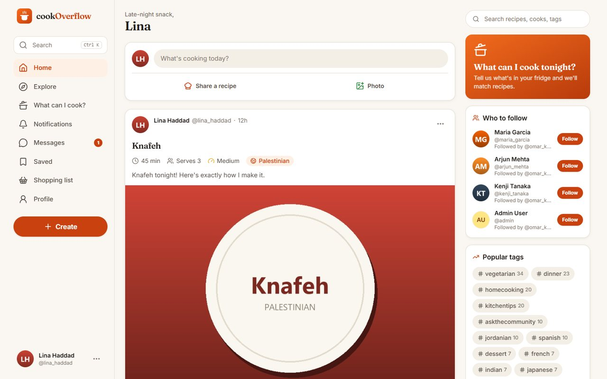
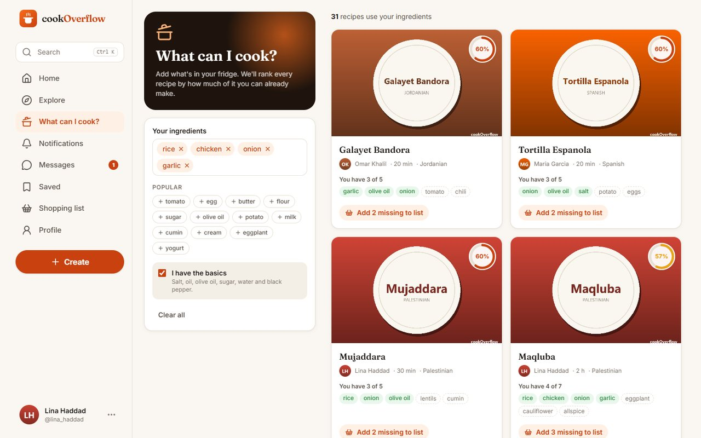
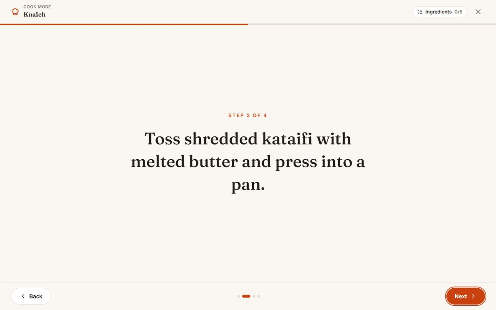
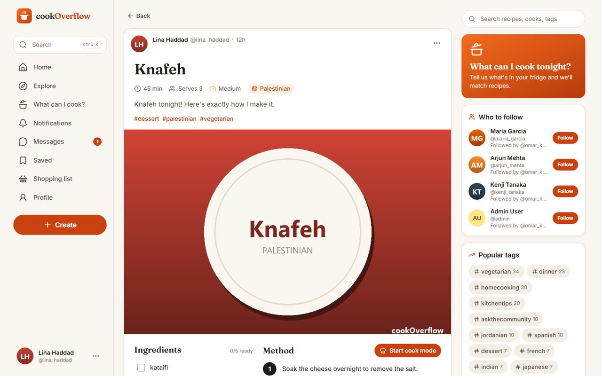
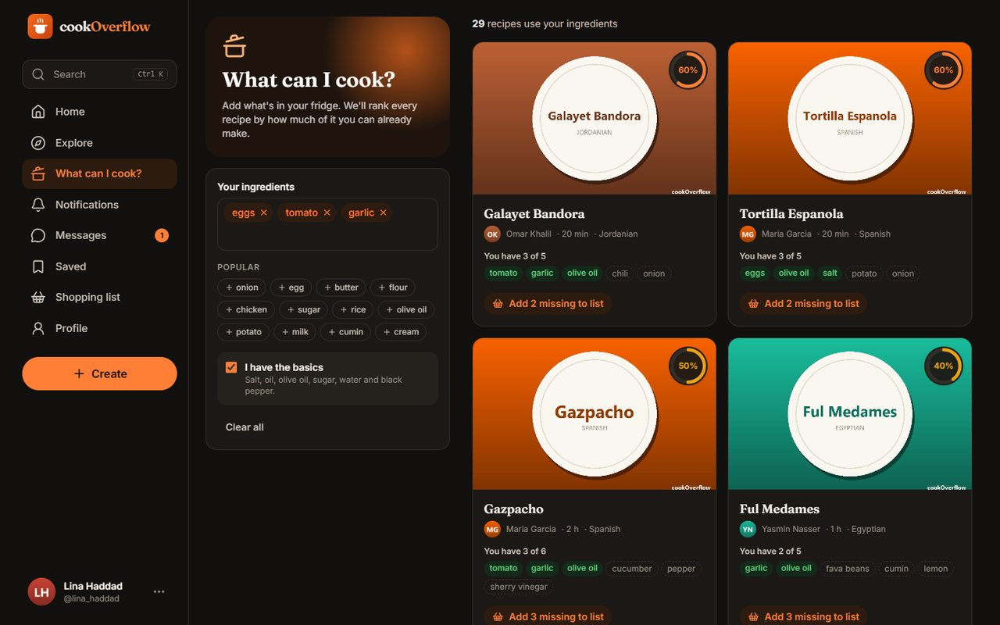
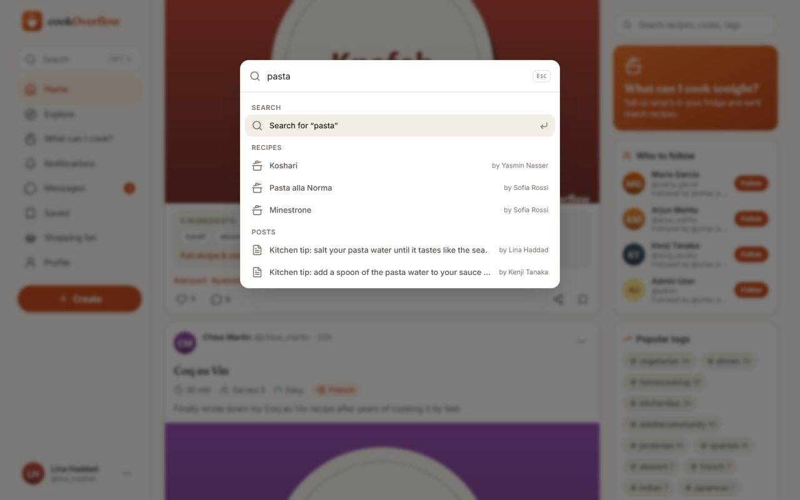
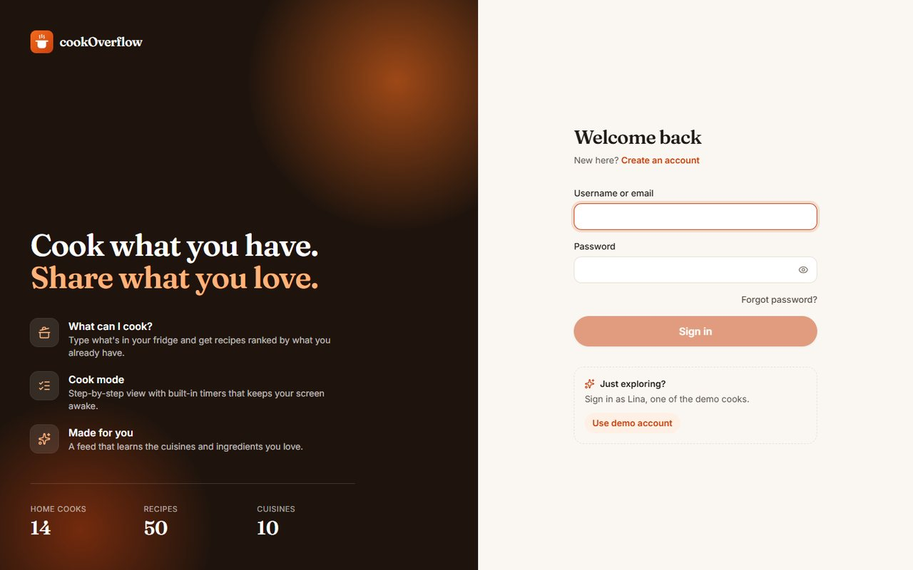
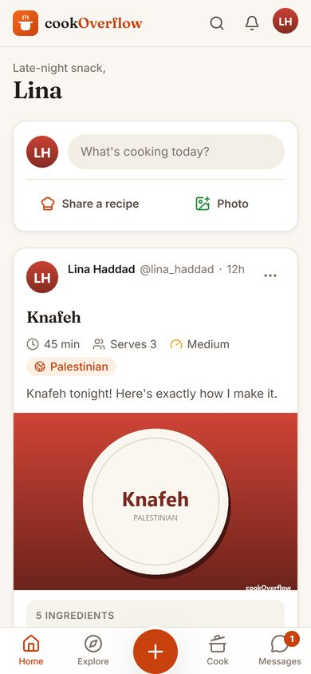
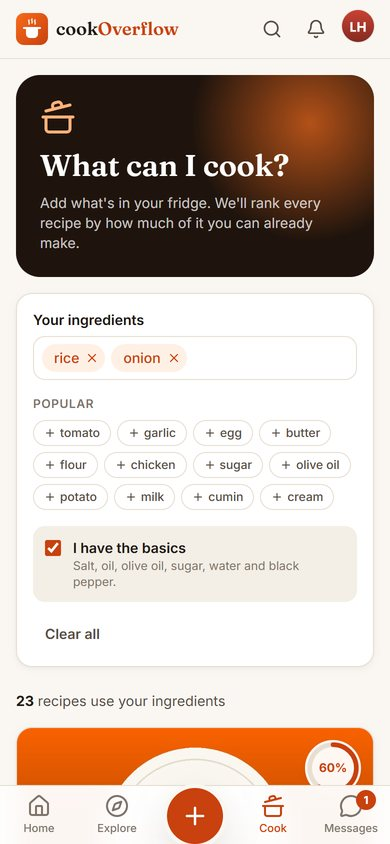
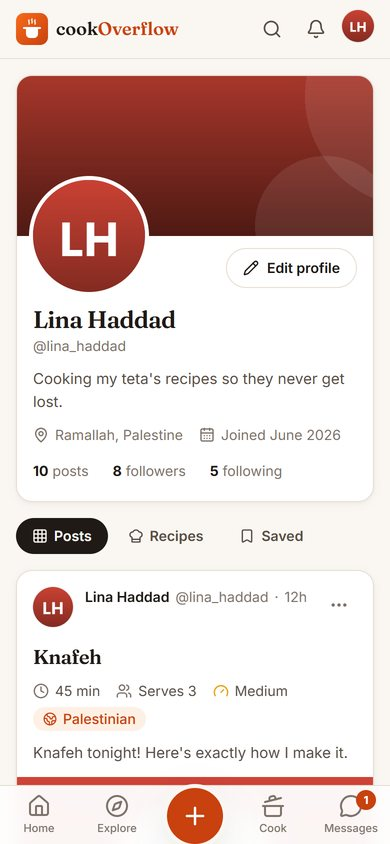

<div align="center">


# cookOverflow

**Cook what you have. Share what you love.**

A social recipe platform: share dishes, find recipes that match the ingredients already in your kitchen,
and cook along step by step.




</div>

## Contents

- [Features](#features)
- [Screenshots](#screenshots)
- [Tech stack](#tech-stack)
- [Getting started](#getting-started)
- [Configuration](#configuration)
- [Testing](#testing)
- [Project structure](#project-structure)
- [API](#api)
- [Background](#background)
- [Team and license](#team-and-license)

## Features

- **What can I cook?** Add the ingredients you have and every recipe is ranked by how much of it you can
  already make. Matched and missing ingredients are shown side by side, and missing ones go to your
  shopping list in one tap. The ingredient list lives in the URL, so a search can be shared.
  Different names for the same thing match ("garbanzo beans" finds chickpea recipes).
- **Scan your fridge.** Snap up to three photos and a vision model lists the ingredients it can see.
  You tick what's really there before it joins the search; guesses start unticked. Needs a Gemini API key.
- **Cook mode.** A full-screen, step-by-step view with large type. Durations in the steps ("simmer for
  40 minutes") become one-tap timers that keep running between steps and chime when done, and the
  screen stays awake while you cook.
- **Structured recipes.** Title, cuisine, time, servings, difficulty, ingredients and ordered steps,
  alongside photos, video and tags.
- **A feed that explains itself.** The *For you* tab learns from your likes, saves and comments and says
  why each post is there ("Because you like #italian"). There's also *Trending*, *Latest* and
  *Recipes*, plus who-to-follow suggestions.
- **Social.** Follow cooks, like, comment, save posts, get notifications and send direct messages.
- **Search everywhere.** Press <kbd>Ctrl</kbd> + <kbd>K</kbd> (or <kbd>/</kbd>) for a command palette
  that searches people, recipes and tags; press <kbd>N</kbd> to start a post.
- **Built with care.** Dark mode, a mobile layout with bottom navigation, instant (optimistic) likes and
  saves, infinite scroll, autosaved drafts, keyboard navigation, screen-reader labels and AA contrast.

## Screenshots

| What can I cook? | Cook mode |
| --- | --- |
|  |  |
| **Recipe** | **Dark mode** |
|  |  |
| **Command palette** | **Sign in** |
|  |  |

<p align="center">
  
  
  
</p>

## Tech stack

| Layer | Tools |
| --- | --- |
| Front end | React 19, TypeScript, Vite, Tailwind CSS 4, TanStack Query, React Router, Lucide icons |
| Back end | Django 4.2, Django REST Framework, drf-spectacular (OpenAPI docs), WhiteNoise |
| Database | SQLite for local development, PostgreSQL supported |
| Tests | Django test runner, Vitest and Testing Library, Playwright driving Microsoft Edge |

The React app talks to the Django REST API with session cookies and CSRF protection. In development,
Vite serves the app on port 5173 and proxies `/api` and `/media` to Django. In production, Django
serves the built app itself.

## Getting started

You need **Python 3.13** and **Node.js 20 or newer**. Commands below are for Windows PowerShell; on
macOS or Linux use `.venv/bin/python` instead of `.venv\Scripts\python`.

**1. Back end** (from the project root)

```powershell
python -m venv .venv
.venv\Scripts\python -m pip install -r requirements.txt
.venv\Scripts\python manage.py migrate
.venv\Scripts\python manage.py seed_demo_data     # optional: 10 demo cooks and 100 posts
.venv\Scripts\python manage.py runserver
```

**2. Front end** (in `frontend/`)

```powershell
npm install
npm run dev
```

Open <http://localhost:5173>. On localhost, the sign-in page offers a one-click demo account
(`lina_haddad`, password `cookdemo123`, like every seeded account).

To run everything from Django alone, build once with `npm run build` and open <http://127.0.0.1:8000>.

| URL | What |
| --- | --- |
| `/` | The React app |
| `/api/docs/` | Interactive API documentation |
| `/admin/` | Django admin (create an account with `manage.py createsuperuser`) |
| `/legacy/` | The original Django-template site from 2022 |

**Demo traffic.** With the server running, `manage.py simulate_traffic --sessions 30` signs in as the
demo cooks and browses, likes, comments, follows and sends messages through the real endpoints.

## Configuration

Settings come from environment variables; [`.env.example`](.env.example) lists all of them with their
defaults. Nothing is required for local development.

| Variable | Default | Purpose |
| --- | --- | --- |
| `DJANGO_SECRET_KEY` | development key | Set a long random value in production |
| `DJANGO_DEBUG` | `true` | Set to `false` in production |
| `DJANGO_ALLOWED_HOSTS` | empty | Comma-separated host names |
| `DB_ENGINE` | SQLite | `postgres` to use PostgreSQL, with `DB_NAME`, `DB_USER`, `DB_PASSWORD`, `DB_HOST`, `DB_PORT` |
| `EMAIL_BACKEND` | console | `django.core.mail.backends.smtp.EmailBackend` to send real mail |
| `EMAIL_HOST_USER`, `EMAIL_HOST_PASSWORD` | empty | SMTP login (for Gmail, use an app password) |
| `EMAIL_VERIFICATION_REQUIRED` | on only with SMTP | Require new accounts to confirm their email |
| `GEMINI_API_KEY` | empty | Turns on *Scan your fridge*. Each scan is one paid Gemini API call (30 per user per hour) |
| `COOK_SCAN_MODEL` | `gemini-3.1-flash-lite` | Gemini model that reads the photos |

In local development, emails (such as password-reset links) are printed in the Django console, and
the reset page links to them directly.

## Testing

```powershell
.venv\Scripts\python manage.py test api     # API tests
cd frontend
npm run typecheck                           # TypeScript
npm test                                    # unit tests (Vitest)
npm run e2e                                 # browser tests in Microsoft Edge; both servers must be running
```

The browser tests sign in through the UI, visit every page on desktop, mobile and dark mode, create and
delete a post, and use cook mode. They fail on any console error or failed request.

## Project structure

```text
.
├── api/                  REST API: views, serializers, recommendations, ingredient matching, tests
├── frontend/             React app
│   ├── src/pages/        One file per screen
│   ├── src/components/   Layout, posts, composer, UI kit
│   ├── src/lib/          API client, queries, stores, helpers
│   └── e2e/              Browser tests
├── Account/  Profile/  Timeline/  communications/  notifications/  core/
│                         Django apps: models, admin, migrations and the legacy pages
├── cookOverflow/         Django settings and URLs
├── templates/  static/   Legacy Django-template site (served under /legacy/)
├── AI_Search_RecommenderSystem_R&D/
│                         Recipe datasets, scraper and recommender research
└── Documentation/        Report, presentation, UML diagrams and screenshots
```

## API

Browse and try every endpoint at `/api/docs/`. The main ones:

| Endpoint | Description |
| --- | --- |
| `POST /api/auth/register/`, `login/`, `logout/` | Accounts and sessions |
| `GET /api/auth/me/` | The signed-in user |
| `GET /api/posts/feed/` | Posts from people you follow |
| `GET /api/posts/for-you/`, `trending/` | Recommendations |
| `POST /api/posts/` | Create a post or recipe (multipart, with photos) |
| `POST`/`DELETE /api/posts/{id}/like/`, `save/` | Reactions |
| `GET /api/cook/?ingredients=rice,chicken` | Recipes ranked by the ingredients you have |
| `POST /api/cook/scan/` | Fridge photos (multipart `images`, up to 3) to a list of ingredients to confirm |
| `GET /api/search/?q=` | People, posts and tags |
| `GET /api/notifications/`, `/api/conversations/` | Inbox |

## Background

cookOverflow began in 2022 as a senior graduation project: a food social network whose own data powers
a recipe recommender. You give it the ingredients you have, and it tells you what to cook.

The research behind it is in [`AI_Search_RecommenderSystem_R&D/`](AI_Search_RecommenderSystem_R&D): three
scraped recipe datasets, spaCy tokenization and TF-IDF modelling. The project report, presentation and
diagrams are in [`Documentation/`](Documentation).

The whole story, from the 2022 notebook to the 2030 Kitchen, is told in system-design diagrams in
[`Documentation/README.md`](Documentation/README.md).

<details>
<summary>Design diagrams</summary>

| | |
| --- | --- |
| Use cases  | Classes  |
| Activity  | Sequence  |
| States  | Workflow  |
| Search data flow  | Model  |

</details>

## Team and license

Built by **Ahmad Droobi** and **Ataa Shaqour**.

Released under the MIT License.
© Clemson University · © An-Najah National University · © Droobi and Shaqour
